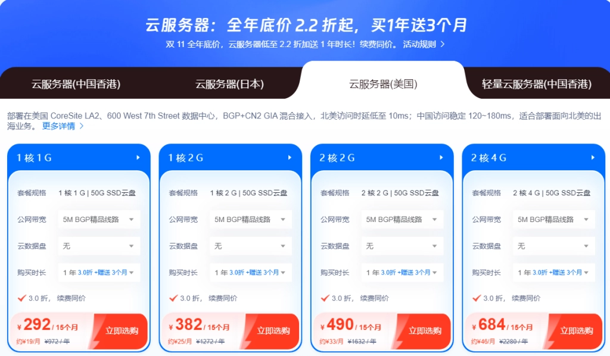
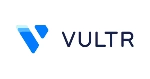

# 2025年美国VPS盘点：便宜、稳定、速度快，真的能全都要

选美国VPS的时候，很多人都在问同一个问题：能不能既便宜又快还稳定？听起来像是在做梦，但实际上确实有这样的服务存在。对于国内用户来说，线路选择很关键——电信CN2、联通AS4837、AS9929以及移动AS58807这些线路，直接决定了你的使用体验。下面这些商家，是我实际测试过或者长期观察下来，确实能做到"三全其美"的选择。

---

## 一、LisaHost 丽萨主机

丽萨主机2017年成立，运营时间够长了。他们家的特点是线路多——三网CN2 GIA、三网AS9929、三网AS4837、国际BGP都有，还提供双ISP、住宅IP和原生IP。特别适合跑游戏、电商、视频流媒体这些对网络要求高的业务。支持安装Windows系统，付款可以用支付宝或者USDT，48小时内不满意可以无条件退款。

### 美国精品网9929线路VPS

这条线路是三网9929，默认给你一个原生IP，IP很干净，跑Tiktok数据表现不错。可以解锁美区游戏、Tiktok、ChatGPT、WhatsApp营销、Netflix、Disney+、HBO Max、ESPN、Amazon Prime Video这些服务。

### 美国4837线路超大带宽VPS（双ISP）

三网AS4837线路，默认分配双ISP家宽住宅美国原生IP。1Gbps超大带宽，用的是NVMe固态硬盘，读写速度很快。支持解锁美区游戏、Tiktok、ChatGPT、WhatsApp营销、亚马逊电商、Netflix等服务，不限流量，还支持Windows系统。

### 美国静态住宅IP家庭宽带VDS

这个产品比较特别——硬件托管在真实的美国家庭住宅里，用的是当地宽带运营商的光纤宽带。100%模拟美国本地上网环境，解锁所有美区服务。稀缺资源，美国静态家宽住宅独享IP，不限流量。宿主机用超大带宽和NVMe固态硬盘。不过要注意，这个不是大陆直连优化网络，建议配合中转使用，记得开启BBR加速。

### 美国精品网CERA高防CN2 GIA原生IP VPS

可以解锁部分美区IP锁区服务，美国原生IP（支持Tiktok、ChatGPT）。六网（电信、联通、移动、广电有线、鹏博士、科技网）回程都是CN2 GIA精品网络，保障网络高峰期低延迟不卡顿。去程直连，保障访问稳定和防御。默认50G防御，100G内秒解，超过100G后15分钟解封，可以付费升级到100G防御。

👉 [想要高性能美国VPS部署全球业务？这里有更多专业级云服务器方案](https://www.vultr.com/?ref=9738262-9J)

## 二、LightNode

LightNode是个全球性的云计算供应商，最大的特点是灵活和可扩展。节点遍布全球39个地方，包括韩国、美国、巴西、澳大利亚、新加坡、日本、南非等国家。

**推荐理由：** 这是家香港云服务商，不需要实名，也不用备案，用邮箱就能注册。全球40多个节点随便选，按小时收费。美国线路优化VPS便宜到只要$0.012/小时起，随时可以换IP。能解锁Netflix等流媒体，也能用ChatGPT，适合外贸电商等各种用途。

## 三、Megalayer

Megalayer是家新锐美国香港服务器提供商，专业做美国服务器、香港服务器，支持CN2服务器、站群服务器、大带宽服务器等。

**优惠码：VPS2024-50%OFF（VPS全场5折）**

用这个优惠码下单，价格低至24.75元/月。

**Megalayer美国VPS方案：**

| 美国VPS-优化带宽 | 美国VPS-全向带宽 |
|---|---|
| CPU：1核 内存：1G 硬盘：50G SSD IP：1个 带宽：15M优化带宽 价格：49.5元/月 | CPU：1核 内存：1G 硬盘：50G SSD IP：1个 带宽：30M全向带宽 价格：49.5元/月 |

**推荐理由：** 香港商家，Vofo的子公司（公司名：香港美嘉雅科技有限公司），不需要实名也不用备案。自有AS号（MEGALAYER – AS139646），美国VPS便宜到只要24.75元/月起，15M带宽不限流量。还有特色的美国住宅IP VPS产品，能解锁Netflix等流媒体，也能用ChatGPT，适合外贸电商等多种用途。

## 四、搬瓦工VPS

搬瓦工（BandwagonHost）专注提供高端线路，成立于2004年，历史悠久，老牌商家值得信赖。他们家美国VPS价格不算便宜，但综合性价比很高。因为线路高端，三网强制走CN2 GIA。CN2 GIA是电信精品CN2中的高端产品，如果说CN2是电信的VIP网络，那CN2 GIA就是精品中的精品，SVIP级别。带宽也很大，提供2.5G~10Gbps CN2 GIA带宽。每次有促销套餐出来都会很快被抢光。

## 五、DMIT

DMIT这个商家和搬瓦工差不多，都是主打CN2 GIA线路VPS。区别在于搬瓦工不带DDoS防御，而DMIT主打CN2 GIA线路的高防VPS，号称"打不死的小强"。商家成立于2018年，同样深受中国用户认可，每次促销套餐一出来也是瞬间被抢购一空。

## 六、恒创科技

恒创科技是家老牌香港公司，成立于2010年，隶属SonderCloud Limited（HK），是全球数据中心基础服务供应商，APNIC和ARIN会员单位，自有ASN、IPv4、IPv6及自营SonderCloud云数据中心。

主营中国香港、美国、日本、韩国等地骨干级机房优质资源，BGP国际多线网络，三网直连，CN2 GIA/CTGNet GIA高速回国。所有服务器部署于TierⅢ+精品机房，环境符合国际严格标准认证，机房元件采用2N冗余机制，可用性达99.982%，保证所有产品长期稳定运行。

## 七、HostWinds

HostWinds是一家提供各种类型托管服务的综合性供应商，VPS服务备受好评。

## 八、Hostinger

Hostinger是一家以低价和高性能著称的VPS供应商。

## 九、萤光云

萤光云服务器既高性能又安全可靠，拥有完善的安全机制、强大的计算能力和灵活的扩展性，能满足用户多样化的需求。萤光云还提供专业的技术支持和优质的售后服务，为用户的使用体验保驾护航。如果你正在寻找一款安全可靠的云服务器，可以考虑萤光云。

## 十、Vultr

Vultr在国内深受用户喜爱。在亚洲的机房有日本东京、韩国首尔、阿姆斯特丹以及新加坡节点。想要更换IP只需要直接删除旧机器重新开VPS就可以。

便宜的只需$2.5/月，网络线路不错，按小时计费，随用随停，而且对新用户时不时送$20、$50。Vultr的新用户送$100的活动还是比较吸引人的。

不过要注意，$2.5/月的套餐不提供IPv4仅IPv6，大多数用户并不适用。所以建议从$3.5/月套餐起步，价格均为/月，但商家支持按小时计费，随时可以自行删除退回余额到账户。

## 十一、DigitalOcean

DigitalOcean最适合希望部署负担得起的云基础架构的开发人员。

不过要注意，如果你是需要大量支持的新手用户，或者需要取消试用或要求退款，可能会遇到一些问题。

---

这些就是2024年值得推荐的美国VPS选择。它们不仅价格亲民，对国内用户来说连接速度也快，服务相当稳定。选择VPS的时候，除了看价格，线路、带宽、IP质量这些因素同样重要。根据自己的实际需求——是跑网站、做电商、还是其他用途——选择合适的商家和套餐，才能真正做到"便宜+稳定+速度，全部都要"。👉 [如果你需要更灵活的全球化部署方案，这里有按小时计费的专业云服务](https://www.vultr.com/?ref=9738262-9J)
